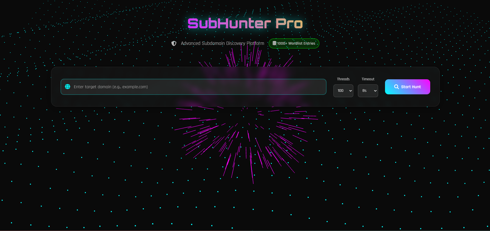
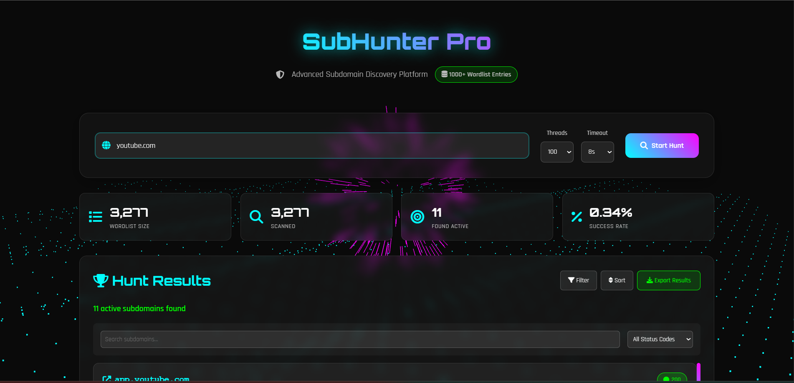
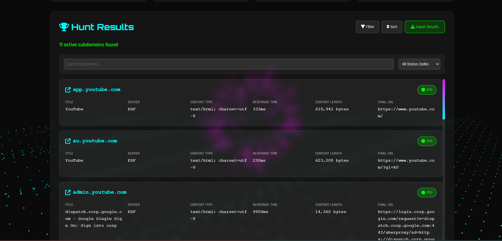

# 🎯 SubHunter Pro - Advanced Subdomain Discovery Platform

**🚀 A cutting-edge cybersecurity tool for comprehensive subdomain enumeration and reconnaissance**

*Professional-grade subdomain discovery with real-time scanning, advanced analytics, and cyberpunk aesthetics*

---

## 📸 Screenshots

### Main Interface

*Futuristic cyberpunk interface with animated background and intuitive controls*

### Real-time Scanning Progress

*Live progress tracking with speed monitoring and discovery feed*

### Results Dashboard

*Comprehensive results with detailed subdomain information and analytics*

---

## ✨ Key Features

### 🎯 **Advanced Subdomain Discovery**
- **5000+ Premium Wordlist** - Comprehensive dictionary covering enterprise, cloud, DevOps, and security infrastructure
- **Multi-threaded Scanning** - Concurrent processing with 50-200 configurable threads
- **Smart DNS Resolution** - Intelligent domain validation with fallback mechanisms
- **HTTP/HTTPS Detection** - Automatic protocol detection and comprehensive testing
- **Duplicate Prevention** - Advanced deduplication to ensure clean results

### 🚀 **Real-time Performance Monitoring**
- **Live Progress Tracking** - Real-time scan progress with domains remaining counter
- **Speed Analytics** - Live requests per second (req/s) monitoring
- **ETA Calculations** - Intelligent time estimation for scan completion
- **Live Discovery Feed** - Real-time subdomain discovery notifications
- **Performance Optimization** - Adaptive threading based on system capabilities

### 🎨 **Modern Cyberpunk UI/UX**
- **Animated Backgrounds** - Vanta.js powered particle effects
- **Responsive Design** - Perfect on desktop, tablet, and mobile devices
- **Interactive Elements** - Smooth animations and hover effects
- **Dark Cyberpunk Theme** - Professional aesthetic for security professionals
- **Accessibility Features** - Screen reader compatible and keyboard navigation

### 📊 **Comprehensive Analytics Dashboard**
- **Real-time Statistics** - Wordlist size, scanned count, found count, success rate
- **Response Analysis** - HTTP status codes, response times, content length analysis
- **Server Fingerprinting** - Web server identification and technology detection
- **Content Analysis** - Automatic page title extraction and content type detection
- **Performance Metrics** - Detailed timing and efficiency analytics

### 🔧 **Professional Configuration**
- **Thread Control** - Adjustable concurrent thread count (50-200 threads)
- **Timeout Management** - Customizable request timeout (5-15 seconds)
- **Advanced Filtering** - Search by subdomain name, title, or status code
- **Multi-level Sorting** - Sort by subdomain, status, response time, or content length
- **Custom Wordlists** - Support for custom subdomain dictionaries

### 📤 **Enterprise Export & Reporting**
- **Detailed Reports** - Complete subdomain information with metadata
- **Filtered Exports** - Export only filtered/sorted results
- **Timestamp Tracking** - Automatic scan timestamp and duration recording
- **Professional Formatting** - Clean, structured output for reporting

---

## 🛠️ Installation & Setup

### Quick Installation

1. **Clone Repository**
- *git clone https://github.com/Adityakumar09/subhunter-pro.git*
- *cd subhunter-pro*

2. **Install Dependencies**
- *pip install flask requests dnspython urllib3 concurrent.futures*

3. **Launch Application**
- *python app.py*

4. **Access SubHunter Pro**
- *Open browser: http://localhost:5000*

---

## 🚀 Usage Guide

### Basic Subdomain Scanning

1. **Enter Target Domain**
- Input domain without protocol (e.g., `example.com`)
- Supports all TLD formats (.com, .org, .net, etc.)

2. **Configure Scan Settings**
- **Threads**: 50-200 (recommended: 100-150)
- **Timeout**: 5-15 seconds (recommended: 8 seconds)

3. **Start Discovery**
- Click "Start Hunt" button
- Monitor real-time progress and live feed

4. **Analyze Results**
- Review discovered subdomains with detailed metadata
- Use filtering and sorting for analysis

### Advanced Features

#### **Real-time Monitoring**
Live progress bar with percentage completion
✅ Domains remaining counter
✅ Requests per second (req/s) speed monitoring
✅ Estimated time of arrival (ETA)
✅ Live discovery feed with found subdomains

#### **Result Filtering & Analysis**
 Search Filter: Find specific subdomains by name or title
📊 Status Filter: Filter by HTTP response codes (200, 301, 403, etc.)
🔄 Multi-sort: Sort by subdomain, status, response time, content length
📈 Analytics: Success rate, performance metrics, timing analysis

#### **Professional Export Options**
📄 CSV Export: Spreadsheet-compatible format for analysis

---

## 📋 Changelog & Version History

### v2.1.0 (Current) - Enhanced Security Focus
- ✨ Added 5000+ comprehensive wordlist with security-focused entries
- 🚀 Implemented real-time progress tracking with live feed
- 📊 Enhanced analytics dashboard with detailed metrics
- 🎨 Redesigned UI with cyberpunk theme and animations
- 📤 Multiple export formats (CSV, JSON, TXT)
- 🔧 Advanced filtering and sorting capabilities
- 🛡️ Enhanced security features and input validation
- 📱 Improved mobile responsiveness
- ⚡ Performance optimizations and memory management

### v2.0.0 - Major Overhaul
- 🎯 Complete UI/UX redesign
- 🚀 Multi-threaded scanning engine
- 📊 Real-time statistics and monitoring
- 🔧 Advanced configuration options

### v1.5.0 - Feature Expansion
- 📈 Enhanced wordlist (1000+ entries)
- ⚡ Performance improvements
- 🛡️ Security enhancements
- 📱 Mobile responsive design

### v1.0.0 - Initial Release
- 🎯 Basic subdomain discovery
- 📊 Simple results display
- 📤 CSV export functionality

---

## 📄 License & Legal

### MIT License

Copyright (c) 2025 SubHunter Pro Team

Permission is hereby granted, free of charge, to any person obtaining a copy
of this software and associated documentation files (the "Software"), to deal
in the Software without restriction, including without limitation the rights
to use, copy, modify, merge, publish, distribute, sublicense, and/or sell
copies of the Software, and to permit persons to whom the Software is
furnished to do so, subject to the following conditions:

The above copyright notice and this permission notice shall be included in all
copies or substantial portions of the Software.

THE SOFTWARE IS PROVIDED "AS IS", WITHOUT WARRANTY OF ANY KIND, EXPRESS OR
IMPLIED, INCLUDING BUT NOT LIMITED TO THE WARRANTIES OF MERCHANTABILITY,
FITNESS FOR A PARTICULAR PURPOSE AND NONINFRINGEMENT. IN NO EVENT SHALL THE
AUTHORS OR COPYRIGHT HOLDERS BE LIABLE FOR ANY CLAIM, DAMAGES OR OTHER
LIABILITY, WHETHER IN AN ACTION OF CONTRACT, TORT OR OTHERWISE, ARISING FROM,
OUT OF OR IN CONNECTION WITH THE SOFTWARE OR THE USE OR OTHER DEALINGS IN THE
SOFTWARE.

### Disclaimer
This tool is designed for legitimate security testing and research purposes only. Users are responsible for ensuring compliance with applicable laws and regulations. The developers assume no liability for misuse of this software.

---

## 🙏 Acknowledgments & Credits

### Technologies & Libraries
- **Flask** - Lightweight WSGI web application framework
- **Vanta.js** - Animated 3D backgrounds and particle effects
- **Font Awesome** - Comprehensive icon library
- **Google Fonts** - Orbitron and Rajdhani typography
- **Three.js** - 3D graphics library for web animations

### Security Community
- **OWASP** - Web application security guidance
- **SANS Institute** - Cybersecurity training and resources
- **Kali Linux Team** - Security testing inspiration
- **SecLists Project** - Wordlist compilation references
- **Bug Bounty Community** - Real-world testing insights

### Special Thanks
- Cybersecurity researchers and ethical hackers
- Open source contributors and maintainers
- Beta testers and feedback providers
- Security conference speakers and educators

---

## 📞 Support & Community

### Getting Help
- 📧 **Email Support**: subhunter.pro@gmail.com
- 💬 **Discord Community**: [Join our server](https://discord.gg/subhunter-pro)
- 🐛 **Bug Reports**: [GitHub Issues](https://github.com/yourusername/subhunter-pro/issues)
- 📚 **Documentation**: [Wiki & Guides](https://github.com/yourusername/subhunter-pro/wiki)
- 💡 **Feature Requests**: [GitHub Discussions](https://github.com/yourusername/subhunter-pro/discussions)

### Community Guidelines
- Be respectful and professional
- Help others learn and grow
- Share knowledge and experiences
- Follow ethical hacking principles
- Respect privacy and security

### Stay Updated
- ⭐ **Star this repository** to stay notified of updates
- 👀 **Watch releases** for new version notifications
- 🐦 **Follow on Twitter**: [@SubHunterPro](https://twitter.com/subhunterpro)
- 📰 **Blog Updates**: [subhunter-pro.com/blog](https://subhunter-pro.com/blog)

---

## 🌟 Star History

---

**⭐ If you find SubHunter Pro useful, please star this repository!**

**🔐 Built with ❤️ for the cybersecurity community**

*SubHunter Pro - Professional Subdomain Discovery Made Simple*

